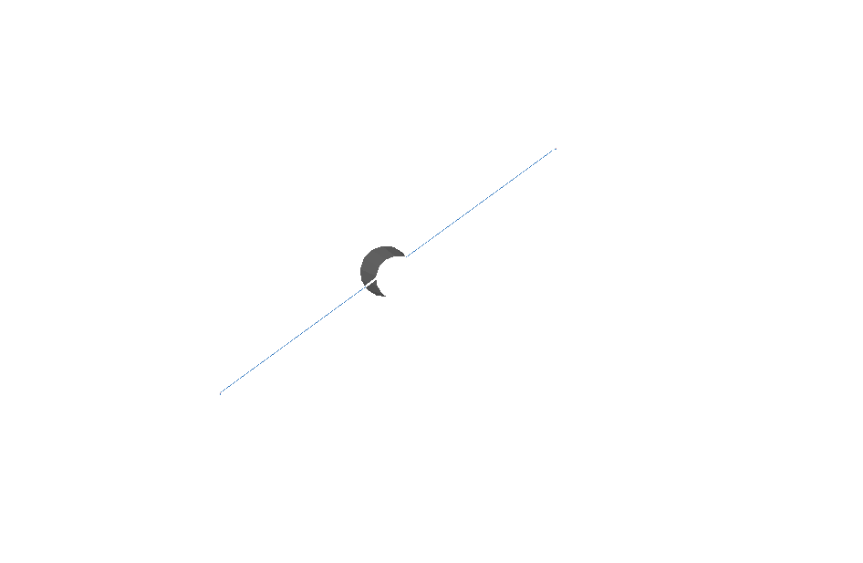
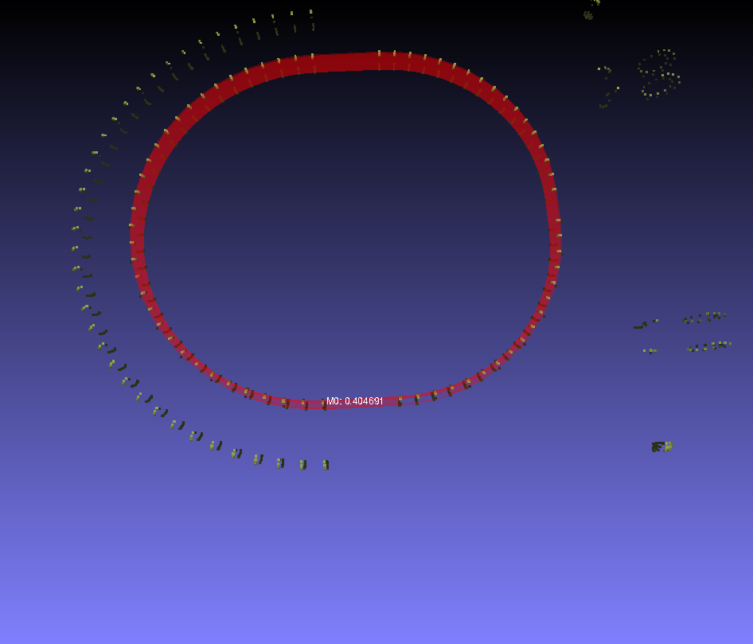
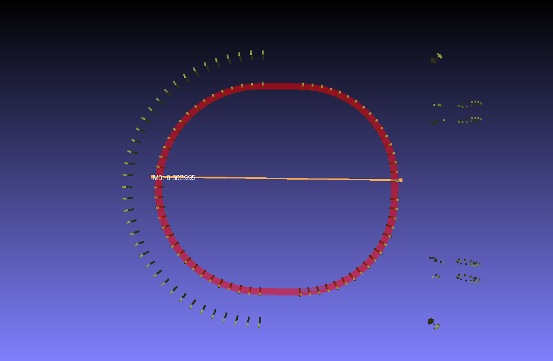

- brush sweeping stick cleaning head diameter : 0.064850m

- toilet seat inner minor axis length : 0.404691m

- toilet seat outer minor axis length : 0.557320m

- width of toilet seat, $(0.557320-0.404691)/2 = 0.075m$

- toilet seat inner major axis length : 0.503995m

- toilet seat outer major axis length : $(0.50399 + 0.075) = 0.57899m$

